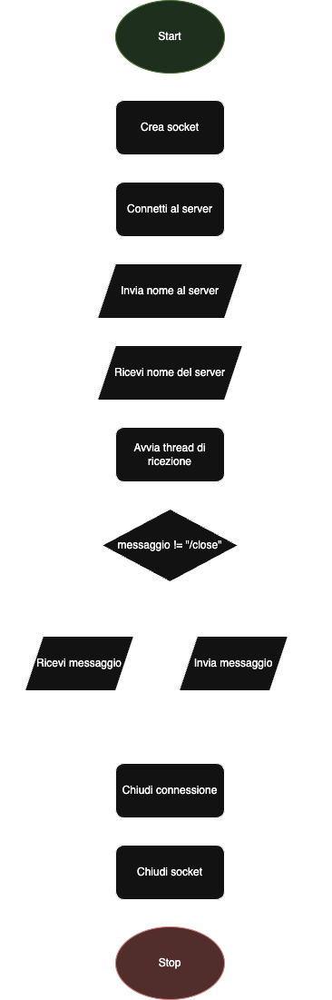

# Diagrammi di Flusso del Server e del Client

## Flowchart del Server:

Il diagramma di flusso del server mostra le principali operazioni che il server esegue per gestire una connessione con un client. Il flusso inizia con l’avvio del server, seguito dalla creazione e associazione di un socket al server. Il server entra quindi in modalità di ascolto in attesa di una connessione da parte di un client. Una volta che la connessione viene accettata, il server invia e riceve informazioni dal client, gestendo la comunicazione tramite due thread separati (uno per inviare e l’altro per ricevere messaggi). Il flusso termina quando la connessione viene chiusa e il server si arresta.

## Flowchart del Client:

Il diagramma di flusso del client descrive le operazioni principali che il client esegue per interagire con il server. Inizia con l’avvio del client, seguito dalla creazione di un socket e dalla connessione al server. Una volta connesso, il client invia il proprio nome al server e riceve la risposta del server. Il client avvia quindi un thread per ricevere i messaggi dal server e, contemporaneamente, invia messaggi in loop. Quando il client invia il comando ‘/close’, la connessione viene chiusa e il client si arresta.

