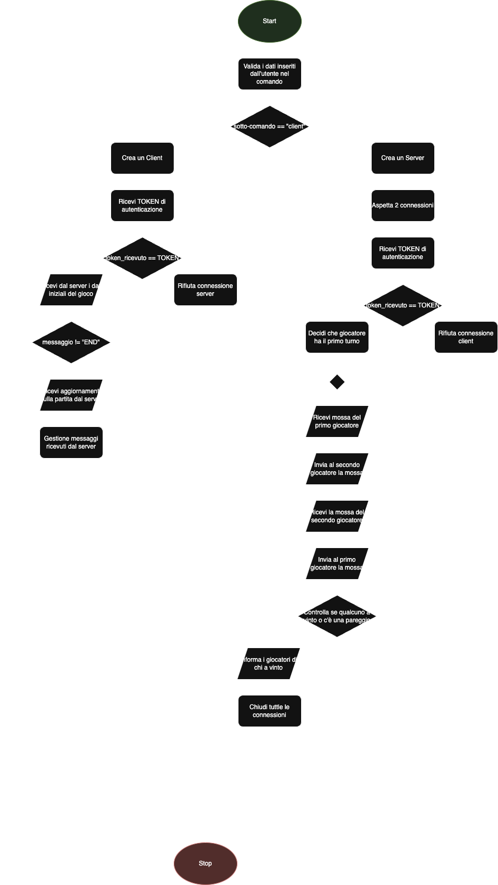

# Diagramma di Flusso del Programma

## Flowchart del Server:

Il diagramma di flusso del server mostra le principali operazioni che il programma esegue per gestire le connessioni con 2 client e una partita a Tris.
Il flusso inizia con l’avvio del client/server in base a quale comando l’utente esegue.
Se l’utente esegue un server viene creato un socket e una volta che due client sono connessi fa iniziare una partita.
Se l’utente esegue un client viene creato un socket che viene connesso al server e gioca contro un altro giocatore

